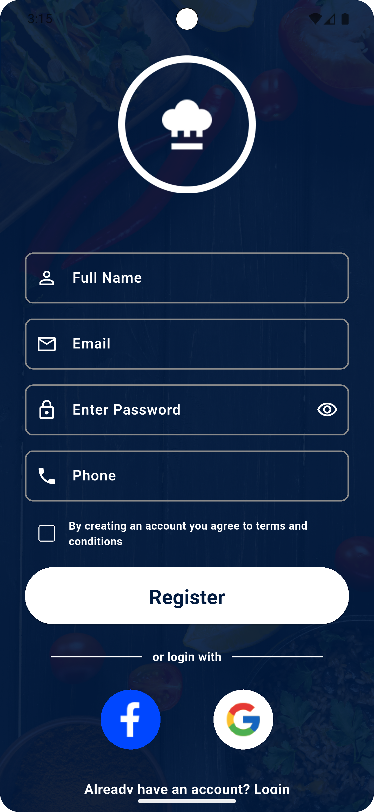
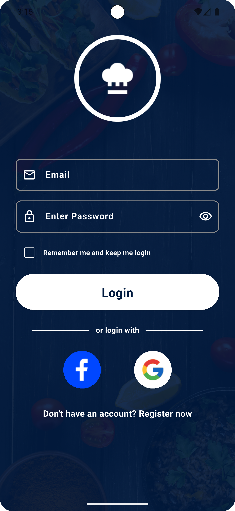
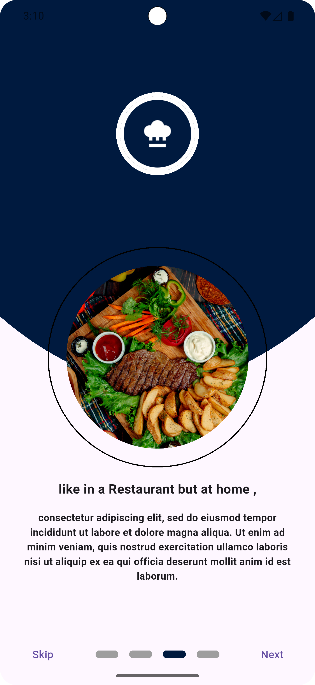
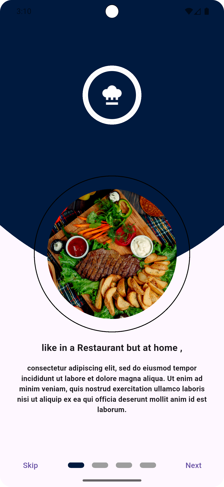
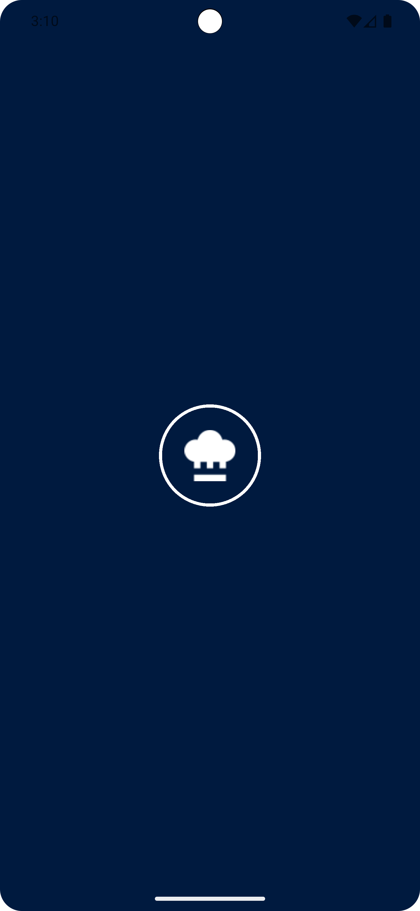
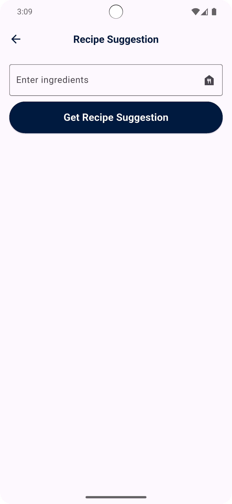
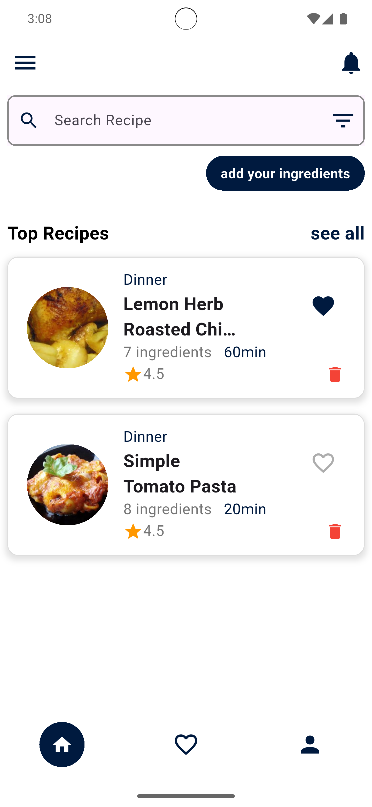
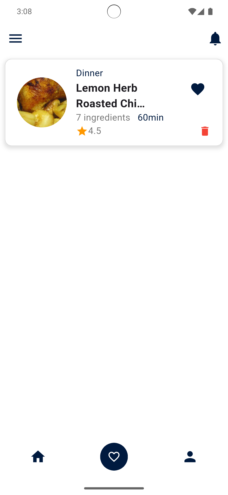
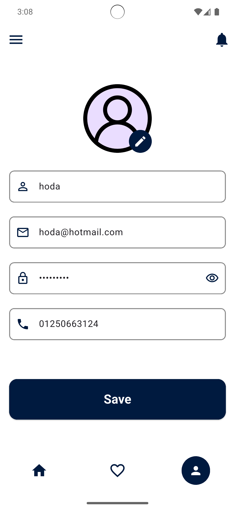

# Meal_App

# 🌟 Overview

The Flutter Meal App is a modern mobile application designed to help users explore, manage, and receive intelligent suggestions for meals. The project combines a robust backend powered by Supabase with the intelligence of Google Gemini AI, all wrapped inside a clean, scalable Flutter architecture.

# 📸 Screenshots

  
  
  
  
  
  
  
  
  

# 🔑 Core Features

 1. Authentication Sign up / Sign in (email, phone, Google, Facebook, etc.) Secure token-based authentication (Supabase Auth) Profile management (update name, email, password, phone).
 2. Home Screen Featured Meals Through Gemini & Supabase 
 3. Home Screen Search Meals With Its Names 
 4. Get Suggested Meals Through Gemini 
 5. Add Meals To Favorites Screen 
 6. Meals Details Multiple images of the meal. Description, specifications, reviews.
 7. On Boarding Screens & Splash Screen  

# 🚀 Main packages used

1. Http To Make Integration With API
2. Cubit As State Management
3. Internet_Connection_Checker To Handle Internet Connection
4. Get_It To Make Dependency Injection
5. Dartz to Functional Programming in Dart
6. Equatable To Simplify Equality Comparisons
7. Flutter ScreenUtil For Responsive Ui
8. Google_Generative_Ai For Doing Chat With Gemini 